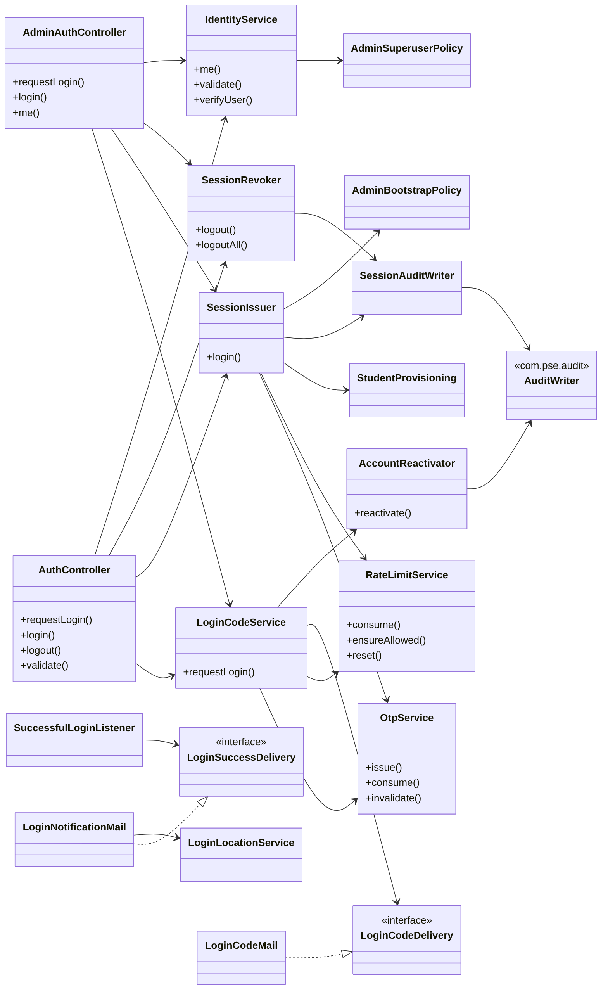
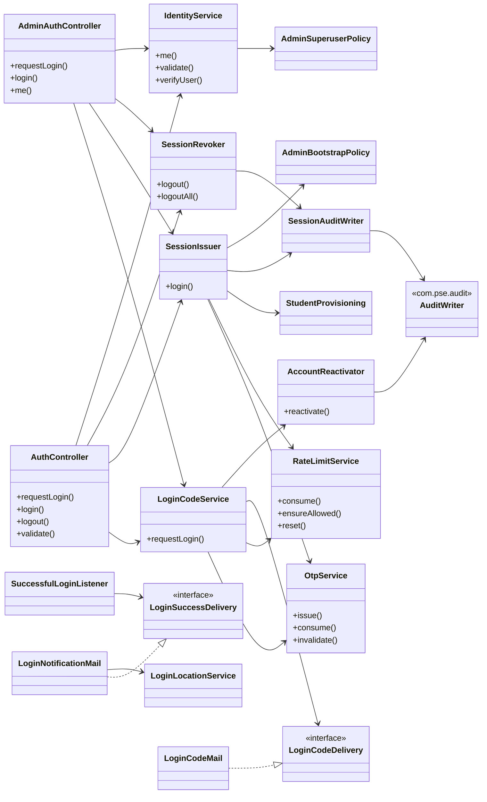
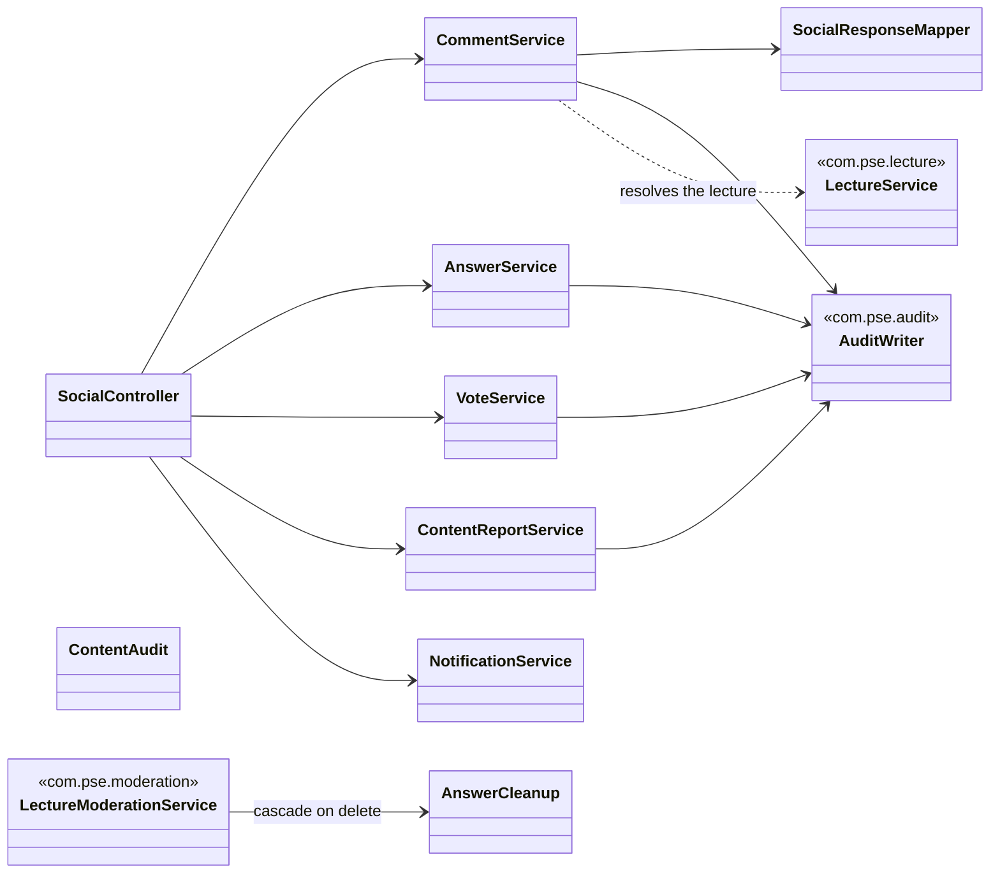
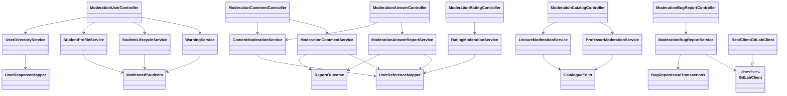
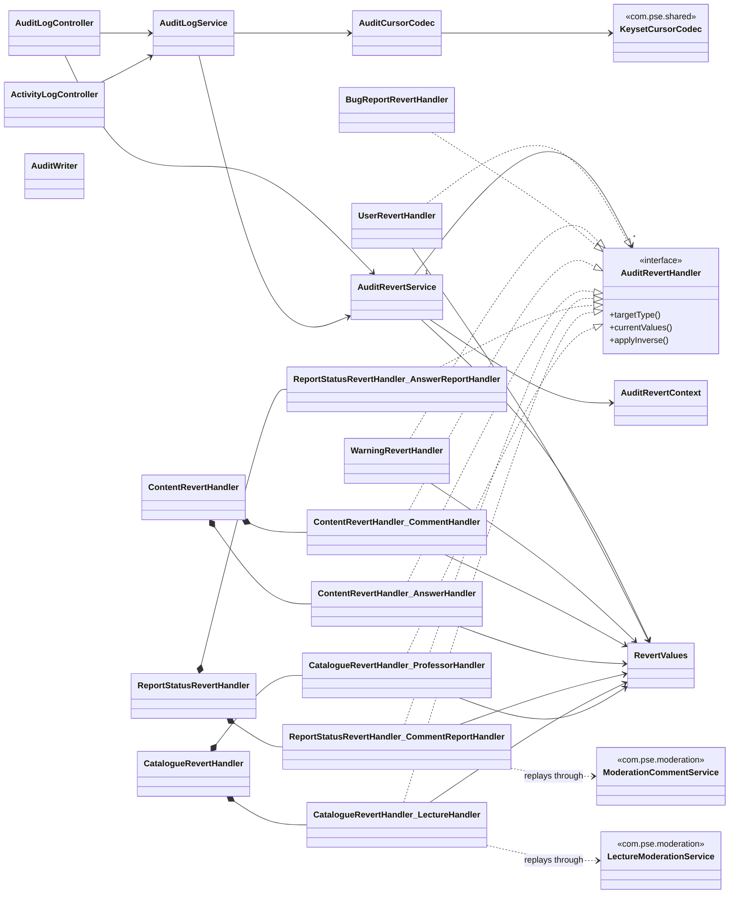
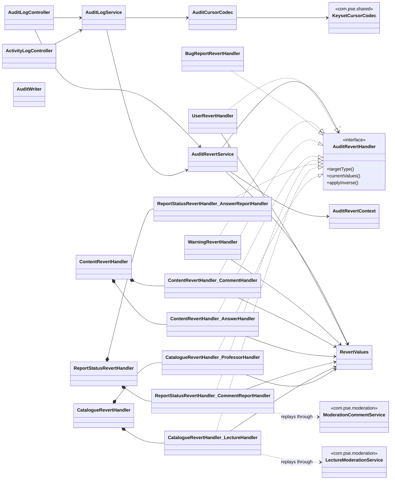
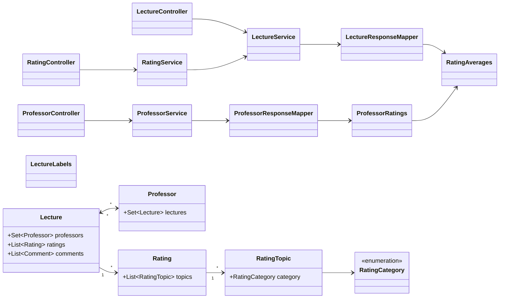
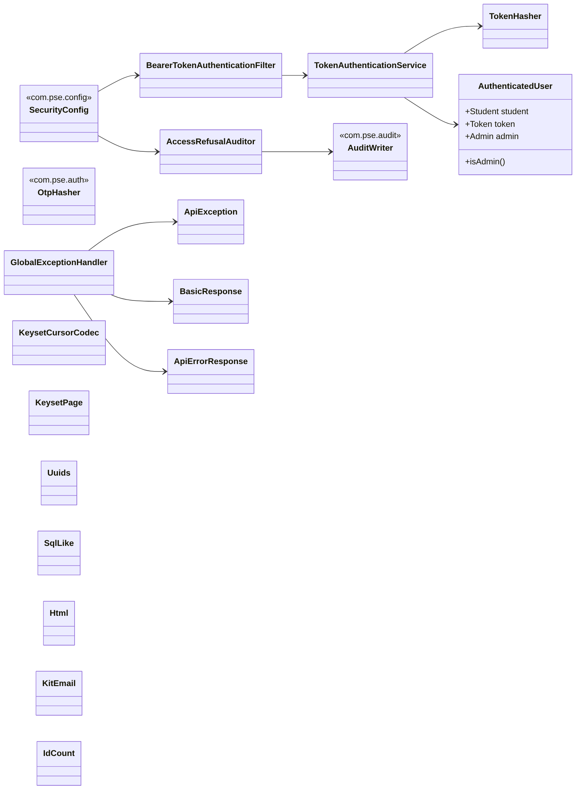
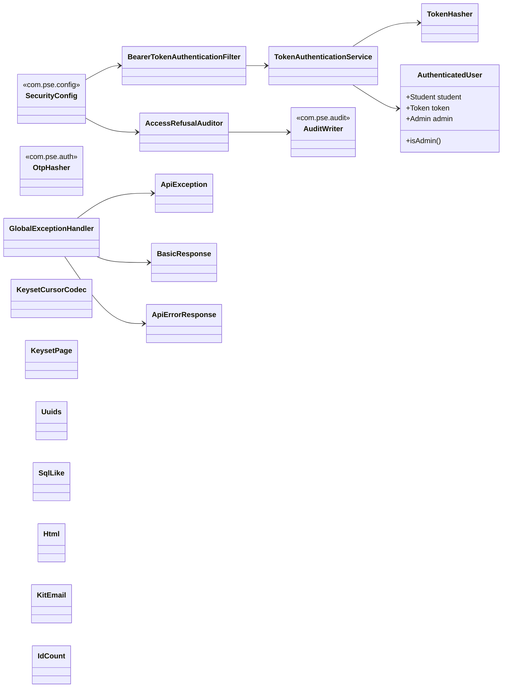

# Klassendiagramme

Six diagrams, one per bounded area, using the names the code has **after** the
single-responsibility refactor ([ADR 0008](adr/0008-single-responsibility-refactor.md)). If you
are holding an older diagram, the old-to-new mapping is in
[test-plan.md](test-plan.md#the-single-responsibility-refactor).

**What is drawn, and what is left out on purpose.** Collaborators, mostly taken from constructor
injection — so an arrow usually means "this class cannot be built without that one", which is the
relationship that actually constrains the design. Some targets are `final` utility classes with
private constructors, called statically rather than injected (`RevertValues`, `LectureLabels`,
the response mappers, `TokenHasher`); an arrow to one of those means "calls", not "holds".
**No getters or setters**: every entity here is a Lombok `@Getter @Setter` record of its columns,
and drawing thirty accessors per box would bury the two or three relationships that matter.
Entities are drawn with their **relations**, not their fields.

**These diagrams are selective, and that is the point rather than an omission.** What is drawn is
the classes that carry a decision: controllers, services, the seams behind interfaces, and the
handful of shared pieces everything reuses. What is deliberately **not** drawn is everything that
carries no decision — repositories (one Spring Data interface per entity, all alike), request and
response DTOs, the entities themselves, enums and exceptions. Four packages have no diagram at
all: `com.pse.config`, `com.pse.user`, `com.pse.system` and `com.pse.health`; `SecurityConfig`
appears as a foreign box in diagram 6 because the chain is a decision, and the rest of its
package is wiring. `com.pse.security` is the only package drawn completely. **102 of the
project's 258 source files appear here**, and a box being absent means "nothing here turns on it",
never "this does not exist".

**Reading the arrows.**

| | |
| --- | --- |
| `-->` | depends on — holds it, or calls it statically |
| `..>` | uses it in passing: a value it returns or a type it names, not a collaborator |
| `..|>` | implements |
| `<-->` | both directions; used once, for the lecture/professor join |
| `"1" --> "*"` | multiplicity, where the code fixes one |

**Package separation** is one diagram per package: the heading names the package, and every box
without a **package-name** stereotype belongs to it. A box carrying one — `<<com.pse.audit>>` on
`AuditWriter` in diagram 2, for instance — is a class from **another** package, drawn because
something in this one cannot be built without it. `<<interface>>` and `<<enumeration>>` say what
a box *is*, not where it lives, and do not mark it foreign.

**Those boxes are not every place a package boundary is crossed**, and it would be wrong to read
them that way: they are the crossings that matter to the picture they appear in. `AuditWriter`
alone is injected by a dozen services across `moderation`, `lecture`, `professor`, `rating` and
`auth`, and drawing every one of those arrows would turn six readable diagrams into one unreadable
graph — which is the same reason there is no whole-application picture: 258 classes in one graph
is a picture of nothing.

**These diagrams are now rendered, and each image below is checked against its source.** They
were structural-only until 10 September: six balanced ```mermaid``` fences, every arrow endpoint a
declared class, and **all 108 boxes verified to resolve to a type under `src/main`** — 102 source
files plus the six nested handler classes. That count was re-confirmed against the fences when the
images were made: 116 `class` declarations across the six diagrams, **108 unique**, the difference
being the deliberate crossings a class appears in more than one picture for.

**How the images were produced**, so they can be reproduced rather than trusted:
`@mermaid-js/mermaid-cli` (`mmdc` 11.17.0) against each extracted fence, `-b white -s 2`, giving
PNGs 1568px wide. They live in `docs/diagrams/` and are committed, because the submission is a PDF
plus a repository link and a diagram that only exists in a renderer is no good to either. **The
renderer is not installed in this repository and there is no CI job for it** — it was installed
outside the tree for this pass, so regenerating an image is a manual step, and the fence below
each image stays the source of truth.

**Every image was opened and compared to its fence.** `<-->` at the end of diagram 5 — the one
construct the previous pass flagged as worth watching in a real renderer — draws correctly, as a
bidirectional association between `Lecture` and `Professor` with `*` at both ends. Nothing
rendered as a Mermaid error box.

**One diagram does not survive a portrait PDF page and it is diagram 3.** At 1568×194 it is
roughly 8:1, because six independent controller trees lay out side by side; scaled to a normal
text width its boxes end up about 1.5 mm tall. It is correct and it is unreadable on A4 portrait.
It needs a landscape page, a full-page rotation, or splitting into two pictures — a redraw, so it
is recorded rather than done: `docs/TODO.md` item 47.

---

## 1. `com.pse.auth` — getting a session, and what a session costs

The area with the most collaborators, because logging in touches rate limiting, one-time codes,
mail delivery, audit and two different session schedules.



**Mermaid source**, kept below the image on purpose: the image is what a PDF shows, and the
fence is what stays reviewable and diffable in the repository.



**`AccountReactivator` is one class for one decision.** It holds what a request for a login code
does to an account that deleted itself, which was written inline in `LoginCodeService` until
10 September. It is drawn separately because that decision is an open question
([F-48](test-findings.md#f-48--an-unauthenticated-caller-can-undo-somebodys-account-deletion)):
whichever way it is answered, the change lands in that box and not in the middle of a method
about mailing codes. Its transaction boundary is the second reason — a `@Transactional` method
called from inside `LoginCodeService` would not be proxied at all.

**Two things the picture is for.** `LoginCodeDelivery` and `LoginSuccessDelivery` are
*interfaces*, and that is the seam every test substitutes: `LoginCodeMail` and
`LoginNotificationMail` are `@Profile("!test")`, so the real SMTP adapters are never constructed
in a test at all. That is why the mail classes sit under *Deliberately uncovered* rather than
being a gap — and it is why `SuccessfulLoginListener` depends only on the interface. The
location lookup hangs off `LoginNotificationMail`, the implementation, not off the listener:
the listener neither knows nor can reach it. And **which controller you log in through decides
the session**, not who you are: both controllers reach the same `SessionIssuer`, and the schedule
is a property of the endpoint.

---

## 2. `com.pse.social` — comments, answers, votes, reports

What `SocialService` (591 lines) became.


**Mermaid source**, kept below the image on purpose: the image is what a PDF shows, and the
fence is what stays reviewable and diffable in the repository.



`ContentAudit` and `SocialResponseMapper` are the two pieces the five services must **not**
each own a copy of: the audit metadata rule (a 120-character preview) and the `userVote`
decision, which has three states that look alike from outside.

---

## 3. `com.pse.moderation` — the administrative surface

The largest area, and the one where the twin pairs live.



**Mermaid source**, kept below the image on purpose: the image is what a PDF shows, and the
fence is what stays reviewable and diffable in the repository.



```mermaid
classDiagram
    direction TB

    class ModerationUserController
    class ModerationCommentController
    class ModerationAnswerController
    class ModerationCatalogController
    class ModerationRatingController
    class ModerationBugReportController

    class UserDirectoryService
    class StudentProfileService
    class StudentLifecycleService
    class WarningService
    class ModeratedStudents

    class ContentModerationService
    class ModerationCommentService
    class ModerationAnswerReportService
    class ReportOutcome

    class LectureModerationService
    class ProfessorModerationService
    class CatalogueEdits

    class RatingModerationService
    class ModerationBugReportService
    class BugReportIssueTransactions
    class GitLabClient {
        <<interface>>
    }
    class RestClientGitLabClient

    class UserResponseMapper
    class UserReferenceMapper

    ModerationUserController --> UserDirectoryService
    ModerationUserController --> StudentProfileService
    ModerationUserController --> StudentLifecycleService
    ModerationUserController --> WarningService

    UserDirectoryService --> UserResponseMapper
    StudentProfileService --> ModeratedStudents
    StudentLifecycleService --> ModeratedStudents
    WarningService --> ModeratedStudents

    ModerationCommentController --> ContentModerationService
    ModerationCommentController --> ModerationCommentService
    ModerationAnswerController --> ContentModerationService
    ModerationAnswerController --> ModerationAnswerReportService
    ModerationCommentService --> ReportOutcome
    ModerationAnswerReportService --> ReportOutcome

    ContentModerationService --> UserReferenceMapper
    ModerationCommentService --> UserReferenceMapper
    ModerationAnswerReportService --> UserReferenceMapper
    RatingModerationService --> UserReferenceMapper

    ModerationCatalogController --> LectureModerationService
    ModerationCatalogController --> ProfessorModerationService
    LectureModerationService --> CatalogueEdits
    ProfessorModerationService --> CatalogueEdits

    ModerationRatingController --> RatingModerationService
    ModerationBugReportController --> ModerationBugReportService
    ModerationBugReportService --> BugReportIssueTransactions
    ModerationBugReportService --> GitLabClient
    RestClientGitLabClient ..|> GitLabClient

```

**`ModerationCommentService` and `ModerationAnswerReportService` are deliberately still two
classes** — the same 150 lines twice. Merging them was measured and declined: thirteen abstract
methods to save a hundred and twenty lines. The **one** rule that could silently diverge —
`ACTION_TAKEN` being the only status that hides content — is extracted as `ReportOutcome`,
which is why both point at it.
`CatalogueEdits` is the same idea for the lecture/professor pair.

---

## 4. `com.pse.audit` and `com.pse.audit.revert` — the trail, and undoing one field



**Mermaid source**, kept below the image on purpose: the image is what a PDF shows, and the
fence is what stays reviewable and diffable in the repository.



**`Outer_Inner` is a nested class.** `ContentRevertHandler`, `ReportStatusRevertHandler` and
`CatalogueRevertHandler` are `final` classes that implement nothing themselves; each holds
**two** `@Component` inner classes (comment/answer, lecture/professor) and **those** are the
beans that implement `AuditRevertHandler`. So the picture shows nine handlers from six files,
which is what the container actually has, and the composition arrows show which file each pair
lives in. Mermaid has no syntax for a nested type, hence the underscore. The pairs are where
[F-31](test-findings.md#f-31--reverting-a-report-status-is-impossible-on-exactly-the-changes-worth-reverting)
was found — one half of a pair behaving differently from the other is exactly the shape that
finding had.

**The dashed arrows out of the handlers are the design.** `applyInverse` does not write fields
itself; it calls the same service the panel calls, so a revert goes through every guard and
writes its own audit entry.

**`AuditRevertService "1" --> "*" AuditRevertHandler`** is a `Map<AuditTargetType,
AuditRevertHandler>`: Spring injects every handler bean and the service selects one by target
type. That is why adding a handler is a new file rather than an edit to a switch.

---

## 5. `com.pse.lecture` / `professor` / `rating` — the catalogue and what it is judged by


**Mermaid source**, kept below the image on purpose: the image is what a PDF shows, and the
fence is what stays reviewable and diffable in the repository.



**The many-to-many is the one worth looking at.** `Lecture.professors` is a `Set`, and
`Professor` overrides neither `equals` nor `hashCode` — so its iteration order is the JVM's and
can differ per run. That is BUG-3, F-21 and half of
[F-35](test-findings.md#f-35--four-more-lists-reaching-the-client-with-no-defined-order), all
from this one edge. Both mappers sort explicitly because of it.

`ProfessorRatings` exists because two unrelated places need the same walk — every rating on
every lecture a professor teaches — and must not disagree about it.

**`LectureLabels` is drawn here and called from nowhere here**, which is deliberate rather than
an oversight. It owns one rule — how a lecture names itself as a single string,
`"M-INFO-101 — Algorithmen 1"` — and every caller is in `social` or `moderation`: the comment,
answer, vote and report services, and five moderation services. It lives in this package because
the rule is about a lecture, and it is a class of its own because it was once five private copies
that had to agree and nothing made them. Drawing its nine inbound arrows from two other diagrams
would say less than this paragraph does.

---

## 6. `com.pse.security` and `com.pse.shared` — the chain, and what everything reuses



**Mermaid source**, kept below the image on purpose: the image is what a PDF shows, and the
fence is what stays reviewable and diffable in the repository.



**`AuthenticatedUser` is the reason the ownership sweep found no IDOR.** Every app-tier handler
takes the caller's identity from `@AuthenticationPrincipal` and never from the request, and
`ApiOwnershipMatrixTests` pins that structurally by reflection over every handler and its
`@RequestBody` type — the invariant, rather than one probe per route, is what keeps the
owner-scoped column one line long.

The `shared` classes exist because each had **two or three copies** before the refactor:
`Html.escape` in two classes, `KitEmail`'s rule in three places, the paging block in three
listings, `toCountMap` in two services. Each one now has one home and its own tests.
